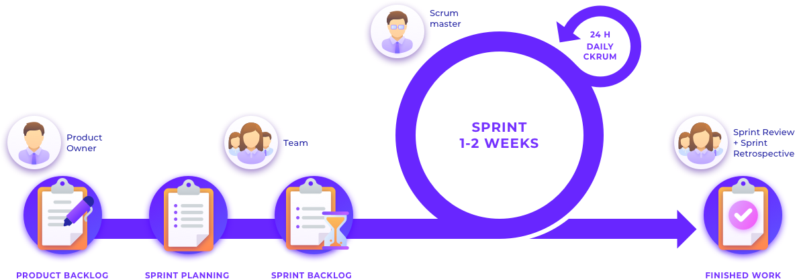
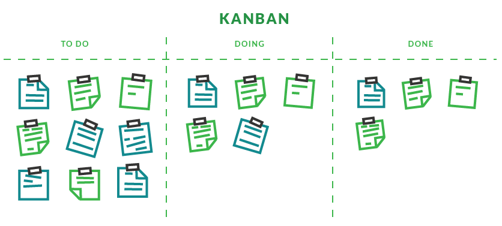

<h1 id="0"> Metodologias Ágeis 🎯​​</h1>

🔙 [Voltar Página Inicial](https://github.com/brseghese/hiring-coders-3-vtex-gama)

<h3>📚 Material de Apoio</h3>

- [PDF](https://drive.google.com/file/d/1E39WJRfVP5v3dCSIwurwfVjNGo1Ol6zs/view)

---

### 📍 Tópicos

1. <a href="#1">Modelo Tradicional x Times Ágeis</a>
2. <a href="#2">Manifesto Ágil</a>
3. <a href="#3">Scrum: Conceito | Papéis | Vantagens</a>
4. <a href="#4">Scrum: Rituais e Cerimônias</a>
5. <a href="#5">Scrum: Artefatos</a>
6. <a href="#6">Scrum: na Prática</a>
7. <a href="#7">Scrum: Refinamento de Backlog</a>
8. <a href="#8">Kanban</a>

---

<h3 id="1"> 1. Modelo Tradicional x Times Ágeis</h3>

<b>Modelo Tradicional</b>

Waterfall - Cascata (passo a passo).

Organização Tradicional:

- Direção
- Gestão
- Operação
- Clientes

Modelo: Gestor | Chefe

<b>Times Ágeis</b>

Trabalho interativo e incremental.

Organização Ágil - Pirâmide Invertida (Orientada ao Cliente):

- Clientes
- Operação
- Gestão
- Direção

Modelo: Líder | Facilitador

<b>Vantagens</b>

- Entregas contínuas
- Entregas com valor
- Aprendizado contínuo
- Feedback constante do cliente
- Flexibilidade na revisão de prioridade

<a href="#0">🔝</a>

---

<h3 id="2">2. Manifesto Ágil</h3>

O Manifesto Ágil começou em 2001.

**Agilidade** é um **MINDSET** estabelecido por <b>4 valores</b>, fundamentados por <b>12 princípios</b> e manifestada através de diversas práticas diferentes.

Ser ágil para fazer ágil!

- Responder a mudanças, sem traumas
- Entregar mais rápido (frequência)
- Assertividade

<b>Os 4 valores:</b>

1.  Indivíduos e Interações (**mais** **que** processos e ferramentas)
2.  Responder a Mudanças (**mais** **que** seguir um plano)
3.  Software em Funcionamento (**mais** **que** documentação abrangente)
4.  Colaboração com o Cliente (**mais** **que** negociação de contratos)

<b>Os 12 Princípios:</b>

1.  Satisfaça o consumidor
2.  Aceite bem as mudanças
3.  Entregas frequentes
4.  Trabalhe em conjunto
5.  Confie e apoie
6.  Conversas face a face
7.  Softwares funcionando
8.  Desenvolvimento sustentável
9.  Atenção contínua
10. Mantenha a simplicidade
11. Times auto-organizáveis
12. Refletir e ajustar

<b>Transformação Ágil</b>

Pessoas e Relações ligadas:

- Estratégia Corporativa
- Processos e Métodos
- Liderança e Cultura
- Comportamento

<a href="#0">🔝</a>

---

<h3 id="3">3. Scrum: Conceito | Papéis | Vantagens</h3>

O Scrum é um dos frameworks que se trabalha dentro da agilidade.

<b>Papéis</b> do Scrum:

- Product Owner (PO): é quem gerencia o Product Backlog.
- Scrum Master: é o facilitador do projeto.
- Time Scrum: é quem desenvolve o projeto.

### 🛠️​ Exercício

<b>MasterChef</b> - Reality Culinário

Comparando os respectivos papeis são:

Os chefes são os PO.  
A apresentadora é a Scrum Master.  
Os cozinheiros são o Time Scrum.  

<a href="#0">🔝</a>

---

<h3 id="4">4. Scrum: Cerimônias</h3>

- Sprint Planning - Planejamento da Sprint
- Sprint - Execução da Sprint
- Daily Meeting - Reuniões Diárias
- Sprint Review - Revisão da Sprint
- Sprint Retrospective - Retrospectiva da Sprint

> <b>Sprints</b> podem ser definidos como cada uma das fases de um projeto, estipuladas em espaços definidos de tempo.

<b>Sprint Planning</b>

- PO com Product Backlog
- Priorização do Product Backlog
- Identificação dos itens para o Sprint Backlog
- Quebra dos itens em pequenas tarefas
- Estimativa

Restultado: <b>Sprint Backlog</b>

<b>Sprint</b>

- Normalmente realizado entre 1 a 4 semanas
- Deve-se manter o padrão de semana desde a primeira Sprint
- Foco nas entregas do Sprint Backlog

<b>Daily Meeting</b>

- Sincronização da equipe nas últimas 24 horas e o plano das próximas 24 horas
- Máximo de 15 minutos
- Stand-up Meeting - em pé

São 3 perguntas:

- O que fiz desde a última reunião?
- O que pretendo fazer até a próxima?
- Possuo algo que esteja me impedindo?

> Scrum Master é quem faz a facilitação.

<b>Sprint Review</b>

- Feita no final da Sprint
- Apresentação do resultado, demonstração da equipe para o PO ou Cliente
- Avaliação do PO se atingiu a meta (Aceite da entrega)
- Feedback do PO para equipe
- Atualização do Product Backlog pelo PO

<b>Sprint Retrospective</b>

- Feita no final da Sprint Review
- Identificar pontos importantes sobre andamento da Sprint
- Levantar pontos de melhoria
- Levantar pontos positivos
- Ideias...
- Reconhecimentos
- Lições aprendidas como forma de melhoria contínua

São 3 perguntas:

- O que acertamos?
- O que erramos?
- O que e como pode melhorar?

Restultado: construir <b>Plano de Ação</b> das melhorias para as próximas Sprints.

<a href="#0">🔝</a>

---

<h3 id="5">5. Scrum: Artefatos</h3>

Projetado para maximizar a transparência das informações

- Product Backlog
- Sprint Backlog
- Incremento

<b>Product Backlog</b>

- Lista ordenada de tudo que é necessário no produto
- Criação, manutenção e o gerenciamento é feito pelo PO

<b>Sprint Backlog</b>

- Lista de itens selecionados do Product Backlog para a Sprint
- Representa o período de 1 a 4 semanas (a ser definido pelo time)
- Após a definição não se altera esse período

<b>Incremento</b>

- Resultado da entrega que agrega funcionalidade e valor para o cliente
- Como entregamos sempre algo com valor, o produto sempre terá um incremento

<a href="#0">🔝</a>

---

<h3 id="6">6. Scrum: na Prática</h3>

<a href="#0">🔝</a>

---

<h3 id="7">7. Scrum: Refinamento de Backlog</h3>

Garantir o entendimento de todos ordenadas pela prioridade

Porque?

- Risco de implementar coisa errada
- Desperdicio de tempo e esforço
- Retrabalho
- Itens de maior valor não ordenado

<a href="#0">🔝</a>

---

<h3 id="8">8. Kanban</h3>

É uma metodologia que se integra e complementa muito bem com o Scrum.

<b>Princípios</b>

- Começar com o que você já faz
- Aceitar a buscar por uma mudança evolutiva e incremental
- Respeitar os processos, funções e responsabilidades atuais
- Encorajar atos de liderança em todos os níveis

"Pare de começar, e começe a terminar".

Serve para:

- Gerenciar fluxo de trabalho
- Equilibrar processos
- Limitar quantidade de trabalho

<a href="#0">🔝</a>

---

### 🔗​ Linkes Úteis

[Trello](https://trello.com/)
