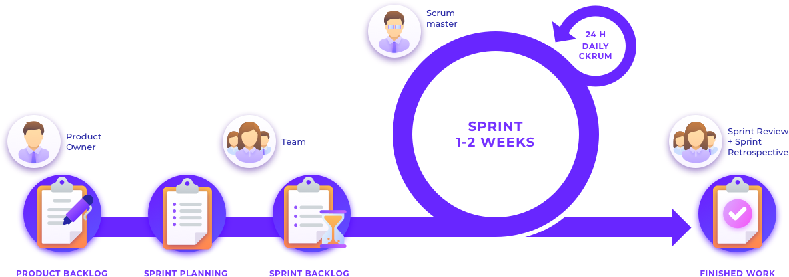
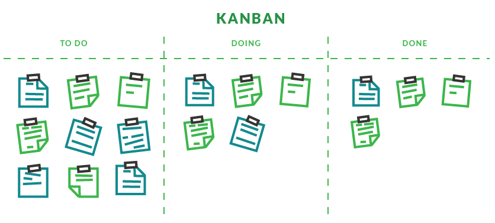

<h1 id="0"> Metodologias Ágeis 🎯​​ - Módulo Aquecimento</h1>

🔙 [Voltar Página Inicial](https://github.com/brseghese/vtex-hiring-coders-3)

<h3>📚 Material de Apoio</h3>

- [PDF](https://drive.google.com/file/d/1E39WJRfVP5v3dCSIwurwfVjNGo1Ol6zs/view)

---

### 📍 Tópicos

1. <a href="#1">Modelo Tradicional x Times Ágeis</a>  
2. <a href="#2">Manifesto Ágil</a>  
3. <a href="#3">Scrum: Conceito | Papéis | Vantagens</a>  
4. <a href="#4">Scrum: Rituais e Cerimônias</a>  
5. <a href="#5">Scrum: Artefatos</a>  
6. <a href="#6">Scrum: na Prática</a>  
7. <a href="#7">Scrum: Refinamento de Backlog</a>  
8. <a href="#8">Kanban</a>  

---

<h3 id="1"> 1. Modelo Tradicional x Times Ágeis</h3>

>  
>
> <b>Modelo Tradicional</b>
>
> Trabalho em cascata (passo a passo).
>
> Organização Tradicional:
>
> - Direção
> - Gestão
> - Operação
> - Clientes
>
> Modelo: Gestor | Chefe   

>  
>
> <b>Times Ágeis</b>
>
> Trabalho interativo e incremental.
>
> Organização Ágil - Pirâmide Invertida (Orientada ao Cliente):
>
> - Clientes
> - Operação
> - Gestão
> - Direção
>
> Modelo: Líder | Facilitador   

>  
>
> <b>Vantagens</b>
>
> - Entregas contínuas
> - Entregas com valor
> - Aprendizado contínuo
> - Feedback constante do cliente
> - Flexibilidade na revisão de prioridade   

<a href="#0">🔝</a>

---

<h3 id="2">2. Manifesto Ágil</h3>

>  
> O Manifesto Ágil começou em 2001.   
>
> **Agilidade** é um **MINDSET** estabelecido por <b>4 valores</b>, fundamentados por <b>12 princípios</b> e manifestada através de diversas práticas diferentes.   
>
> Ser ágil para fazer ágil!
>
> - Responder a mudanças, sem traumas
> - Entregar mais rápido (frequência)
> - Assertividade   

>  
>
> <b>Os 4 valores:</b>
>
> 1. Indivíduos e Interações (**mais** **que** processos e ferramentas)
> 2. Responder a Mudanças (**mais** **que** seguir um plano)
> 3. Software em Funcionamento (**mais** **que** documentação abrangente)
> 4. Colaboração com o Cliente (**mais** **que** negociação de contratos)   

>  
>
> <b>Os 12 Princípios:</b>
>
> 1. Satisfaça o consumidor
> 2. Aceite bem as mudanças
> 3. Entregas frequentes
> 4. Trabalhe em conjunto
> 5. Confie e apoie
> 6. Conversas face a face
> 7. Softwares funcionando
> 8. Desenvolvimento sustentável
> 9. Atenção contínua
> 10. Mantenha a simplicidade
> 11. Times auto-organizáveis
> 12. Refletir e ajustar   

>  
>
> <b>Transformação Ágil</b>
>
> Pessoas e Relações ligadas:
>
> - Estratégia Corporativa
> - Processos e Métodos
> - Liderança e Cultura
> - Comportamento   

<a href="#0">🔝</a>

---

<h3 id="3">3. Scrum: Conceito | Papéis | Vantagens</h3>

>  
> O <b>Scrum</b> é um dos frameworks que se trabalha dentro da agilidade.   
>
> <b>Papéis do Scrum:</b>
>
> - <b>Product Owner</b> (PO): é quem gerencia o Product Backlog.
> - <b>Scrum Master</b>: é o facilitador do projeto.
> - <b>Time Scrum</b>: é quem desenvolve o projeto.   

### 🛠️​ Exercício

>  
> <b>MasterChef</b> - Reality Culinário
>
> Comparando os respectivos papeis são:
>
> Os chefes são os PO.  
> A apresentadora é a Scrum Master.  
> Os cozinheiros são o Time Scrum.   

<a href="#0">🔝</a>

<h3 id="4">4. Scrum: Rituais e Cerimônias</h3>

>  
>
> <b>Sprints</b> podem ser definidos como cada uma das fases de um projeto, estipuladas em espaços definidos de tempo.
>
> <b>Cerimônias:</b>
>
> - Sprint Planning - Planejamento da Sprint
> - Sprint - Execução da Sprint
> - Daily Meeting - Reuniões Diárias
> - Sprint Review - Revisão da Sprint
> - Sprint Retrospective - Retrospectiva da Sprint   

>  
>
> <b>Sprint Planning</b>  
>
> - PO com Product Backlog
> - Priorização do Product Backlog
> - Identificação dos itens para o Sprint Backlog
> - Quebra dos itens em pequenas tarefas
> - Estimativa
>
> Restultado: <b>Sprint Backlog</b>  

>  
>
> <b>Sprint</b>  
>
> - Normalmente realizado entre 1 a 4 semanas
> - Deve-se manter o padrão de semana desde a primeira Sprint
> - Foco nas entregas do Sprint Backlog  

>  
>
> <b>Daily Meeting</b>  
>
> - Sincronização da equipe nas últimas 24 horas e o plano das próximas 24 horas
> - Máximo de 15 minutos
> - Stand-up Meeting - em pé  
>
> São 3 perguntas:
>
> - O que fiz desde a última reunião?
> - O que pretendo fazer até a próxima?
> - Possuo algo que esteja me impedindo?  
>
> Scrum Master é quem faz a facilitação.   

>  
>
> <b>Sprint Review</b>  
>
> - Feita no final da Sprint
> - Apresentação do resultado, demonstração da equipe para o PO ou Cliente
> - Avaliação do PO se atingiu a meta (Aceite da entrega)
> - Feedback do PO para equipe
> - Atualização do Product Backlog pelo PO   

>  
>
> <b>Sprint Retrospective</b>  
>
> - Feita no final da Sprint Review
> - Identificar pontos importantes sobre andamento da Sprint
> - Levantar pontos de melhoria
> - Levantar pontos positivos
> - Ideias...
> - Reconhecimentos
> - Lições aprendidas como forma de melhoria contínua
>
> São 3 perguntas:
>
> - O que acertamos?
> - O que erramos?
> - O que e como pode melhorar?
>
> Restultado: construir <b>Plano de Ação</b> das melhorias para as próximas Sprints.   

<a href="#0">🔝</a>

---

<h3 id="5">5. Scrum: Artefatos</h3>

>  
>
> <b>Artefatos</b>
>
> Projetado para maximizar a transparência das informações
>
> - Product Backlog
> - Sprint Backlog
> - Incremento   

>  
>
> <b>Product Backlog</b>
>
> - Lista ordenada de tudo que é necessário no produto
> - Criação, manutenção e o gerenciamento é feito pelo PO   

>  
>
> <b>Sprint Backlog</b>
>
> - Lista de itens selecionados do Product Backlog para a Sprint
> - Representa o período de 1 a 4 semanas (a ser definido pelo time)
> - Após a definição não se altera esse período   

>  
>
> <b>Incremento</b>
>
> - Resultado da entrega que agrega funcionalidade e valor para o cliente
> - Como entregamos sempre algo com valor, o produto sempre terá um incremento   

<a href="#0">🔝</a>

---

<h3 id="6">6. Scrum: na Prática</h3>

 

 

<a href="#0">🔝</a>

---

<h3 id="7">7. Scrum: Refinamento de Backlog</h3>

>  
>
> Garantir o entendimento de todos ordenadas pela prioridade
>
> Porque?
>
> - Risco de implementar coisa errada
> - Desperdicio de tempo e esforço
> - Retrabalho
> - Itens de maior valor não ordenado   

<a href="#0">🔝</a>

---

<h3 id="8">8. Kanban</h3>

>  
>
> É uma metodologia que se integra e complementa muito bem com o Scrum.
>
> <b>Princípios do Kanban</b>
>
> - Começar com o que você já faz
> - Aceitar a buscar por uma mudança evolutiva e incremental
> - Respeitar os processos, funções e responsabilidades atuais
> - Encorajar atos de liderança em todos os níveis
>
> "Pare de começar, e começe a terminar".
>
> Serve para:
>
> - Gerenciar fluxo de trabalho
> - Equilibrar processos
> - Limitar quantidade de trabalho
>     

 

 

<a href="#0">🔝</a>

---

### 🔗​ Linkes Úteis

[Trello](https://trello.com/)
